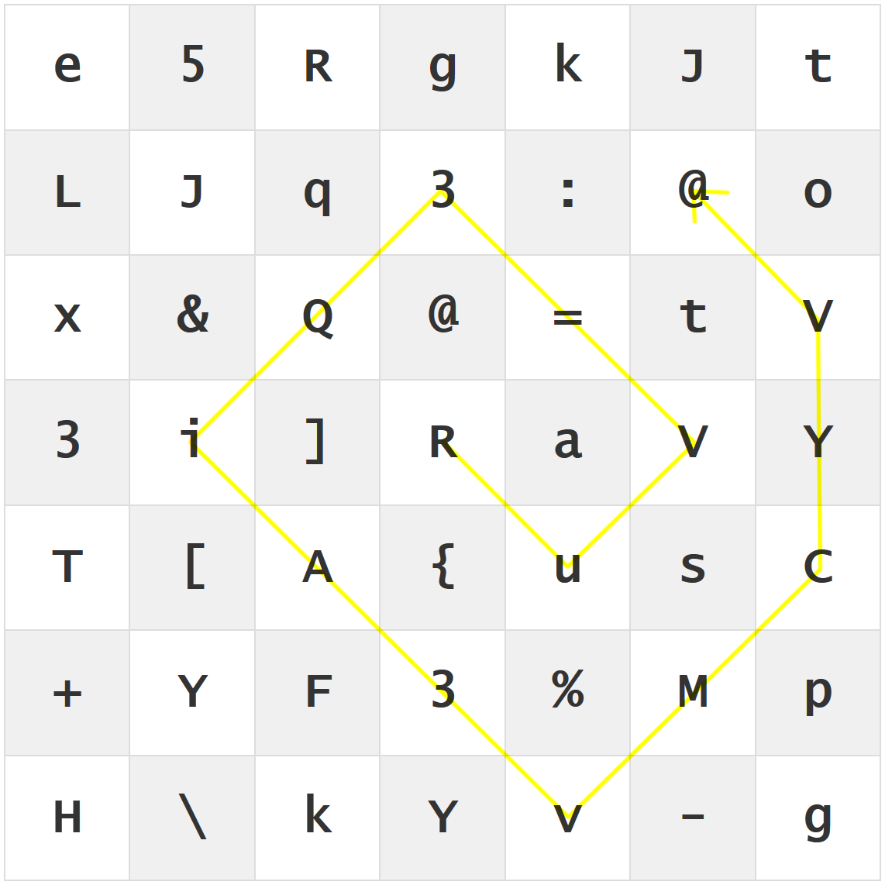

    <a href=".."> switch to English &nbsp; </a>

# ALX Password Matrix

ALX Password Matrix ist ein Werkzeug um Passwort Matrizen zu generieren und anzuzeigen. Diese können dann in Passwort Managern verwendet werden, um Passwörter nicht im Klartext ablegen zu müssen.

!!! hint "Direkt loslegen..."

    <a class="button" href="../PasswordMatrix.htm"><b>Password Matrix starten</b></a> &nbsp;&nbsp;&nbsp;&nbsp;&nbsp; <a class="button"  href="tutorial/PasswordMatrix_1/"><b>Anleitung zur Verwendung</b></a>

## Problemstellung

Das Problem bei üblichen [**Passwort Managern**](tutorial/KeePass_1.md) ist, dass der Passwort Container geknackt werden, oder ein geöffneter Container kompromittiert werden könnte und damit alle Passwörter im Klartext &ndash; direkt verwendbar &ndash; dem Angreifer zur Verfügung stehen würden.

Eine [**Passwort Matrix**](tutorial/PasswordMatrix_1.md) ermöglicht, ein Passwort nicht im Freitext im Passwort Manager abzulegen, sondern pro Passwort eine Matrix aus Zeichen. Das konkrete Passwort lässt sich über ein Schema/einen [persönlichen Pfad](tutorial/PasswordMatrix_3.md), den nur der Eigentümer kennt, im Kopf reproduzieren. Selbst wenn die Matrix gestohlen wird, kann der Angreifer nichts damit anfangen kann, weil er den "Pfad" nicht kennt. Die möglichen Kombinationen sind zu groß, um das Passwort (in absehbarer Zeit) rekonstruieren und ausnutzen zu können.

**Vorteile einer Password Matrix (mit Passwort Manager):**

- :white_check_mark: Es werden keine Freitext-Passwörter gespeichert. Ein Angreifer kann mit der Matrix nichts anfangen
- :white_check_mark: Sichere verschlüsselte Ablage in einem Passwort Manager
- :white_check_mark: Zufällig generierte Passwörter sind schwerer zu knacken, als von Menschen erdachte Passwörter
- :white_check_mark: Es wird einfach, regelmäßig Passwörter zu ändern

!!! warning
    Password Matrix sollte **immer** in Verbindung mit einem Passwort Manager oder verschlüsseltem Container verwendet werden! Nur so wird die erhöhte Sicherheit erreicht.

Auf [folgenden Seiten](tutorial/PasswordMatrix_1/) finden Sie eine Anleitung zur Verwendung von ALX Password Matrix und Passwort Managern.

 

### Generelles zu Passwörtern

Passwörter müssen **sicher** sein und **regelmäßig geändert** werden, um ein Ausnutzen im Fall eines Angriffs zu vermeiden.

!!! hint "Hinweis"
    Hier finden Sie Empfehlungen des BSI zum [Umgang mit Passwörtern](https://www.bsi-fuer-buerger.de/BSIFB/DE/Empfehlungen/Passwoerter/Umgang/umgang_node.html) und zu [sicheren Passwörtern](https://www.bsi-fuer-buerger.de/BSIFB/DE/Empfehlungen/Passwoerter/passwoerter_node.html).

Es gibt viele Möglichkeiten Passwörter zu verwalten, mit allen Vor- und Nachteilen.

- **Im Kopf** &ndash; Passwörter im Kopf merken führt meistens dazu, dass die Passwörter zu einfach sind und zudem häufig für viele Seiten identisch. Das regelmäßige Ändern von Passwörtern stellt eine weitere Herausforderung dar, da neue Passwörter möglichst stark von den alten Passwörtern abweichen müssen.
- **Notizzettel** &ndash; Im einfachsten Fall schreibt man ein Klartext-Passwort auf einen Zettel. Jeder der den Zettel findet kann das Passwort ausnutzen.
- **Text-Datei** &ndash; Eine Text-Datei mit dem Klartext-Passwort ist ähnlich unsicher wie ein Zettel, wenn nicht noch problematischer. Ist der Computer ans Internet angeschlossen kann die Datei online erbeutet und das Passwort vom Angreifer direkt verwendet werden.
- **Passwort Manager** &ndash; Ein Passwort Manager legt Passwörter verschlüsselt ab. Öffnen lässt er sich mit einem (möglichst sicheren) Master Passwort. Wird der Passwort Container erbeutet muss der Angreifer zusätzlich den Container knacken, um an das (Klartext) Passwort zu kommen.
- **Passwort Matrix & Passwort Manager** &ndash; In Verbindung mit einer Passwort Matrix liegen die Passwörter nicht mehr im Klartext im Passwort Manager vor. Selbst nach erfolgreichem Knacken des Containers kann der Angreifer die Passwörter nicht direkt nutzen.

### Vergleich der Methoden

 sicher |  unsicher | 
 eingeschränkt sicher

<table>
    <tr>
        <th></th>
        <th>Zettel</th>
        <th>Text-Datei </th>
        <th>Passwort Manager</th>
        <th>Passwort Matrix + Manager</th>
    </tr>
    <tr>
        <td title="Ist die Art der Ablage sicher?">Sichere Ablage</td>
        <td></td>
        <td></td>
        <td></td>
        <td></td>
    </tr>
    <tr>
        <td title="">Sichere gegen Online Angriffe</td>
        <td></td>
        <td></td>
        <td></td>
        <td></td>
    </tr>
    <tr>
        <td title="">Passwörter nicht verwendbar nach Knacken der Ablage</td>
        <td></td>
        <td></td>
        <td></td>
        <td></td>
    </tr>
</table>

## Passwort Matrix Beispiel
Der [gelbe Pfad](tutorial/PasswordMatrix_3.md) existiert nur im Kopf des Eigentümers. Sollte die Matrix in falsche Hände fallen, kann der Angreifer das Passwort ohne den Pfad nicht rekonstruieren.

