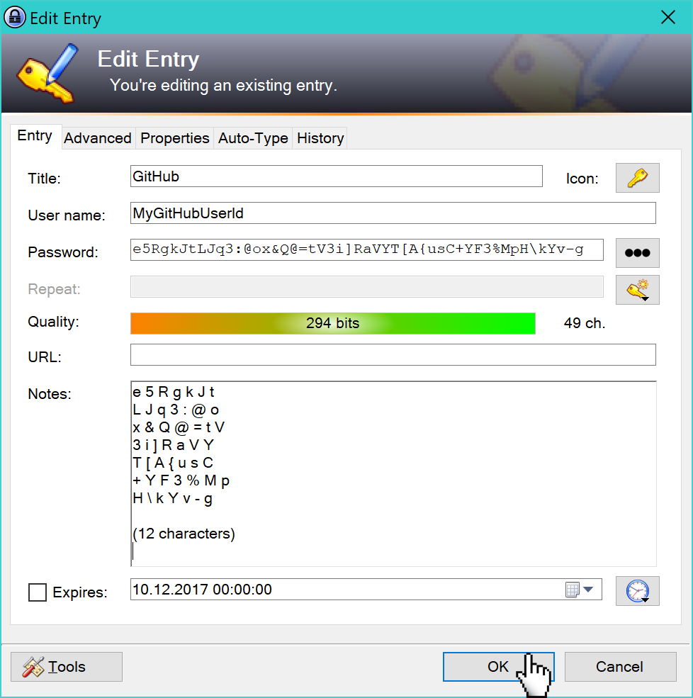

<a class="nav-button pull-right" href="../Veracrypt_1">weiter</a>
<a class="nav-button pull-left" href="../KeePass_3">zurück</a>
 

# Neuen Password Eintrag hinzufügen

Auf dieser Seite wird beschrieben, wie Sie Passwort Einträge zu einer KeePass Datenbank hinzufügen. In unserem Fall fügen wir nicht das Klartext-Passwort hinzu, sondern eine [Passwort Matrix](PasswordMatrix_1.md), welche das Passwort repräsentiert.

<a class="nav-button pull-right" href="../Veracrypt_1">weiter</a>
<a class="nav-button pull-left" href="../KeePass_3">zurück</a>
 
