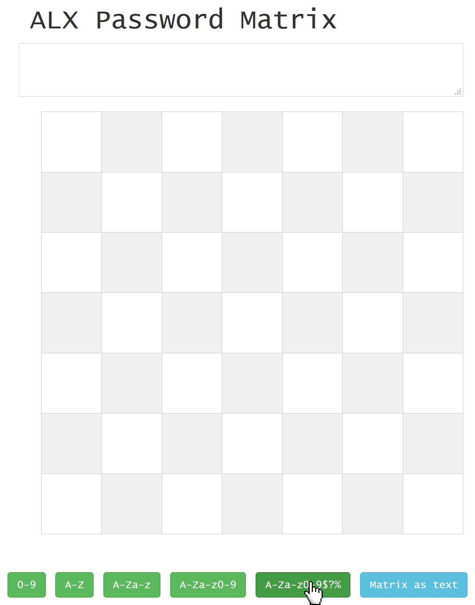

<a class="nav-button pull-right" href="../PasswordMatrix_3">weiter</a>
<a class="nav-button pull-left" href="../PasswordMatrix_1">zurück</a>
 

# 1. ALX Password Matrix öffnen

Öffnen Sie <a target="_blank" class="button" href="../../../PasswordMatrix.htm"><b>Password Matrix</b></a>

- Das "Schachbrett" in der Mitte stellt die (noch leere) Matrix dar. Gefüllt zeigt jedes Feld ein bestimmtes Zeichen an. Über den [persönlichen Pfad](PasswordMatrix_3.md) kann das Passwort wiederhergestellt werden.
- Über die grünen Knöpfe lässt sich jeweils eine neue Passwort Matrix mit zufälligen Zeichen generieren.
- Das Textfeld in der ersten Zeile wird die Passwort Matrix zusätzlich als einzeiligen Text anzeigen.
    - Dieser Text lässt sich z.B. in einen Passwort Manager kopieren.
    - Umgekehrt kann man eine bestehende Passwort Matrix wieder darstellen lassen, indem man den einzeiligen Text in dieses Textfeld einfügt.

<a class="nav-button pull-right" href="../PasswordMatrix_3">weiter</a>
<a class="nav-button pull-left" href="../PasswordMatrix_1">zurück</a>
 
