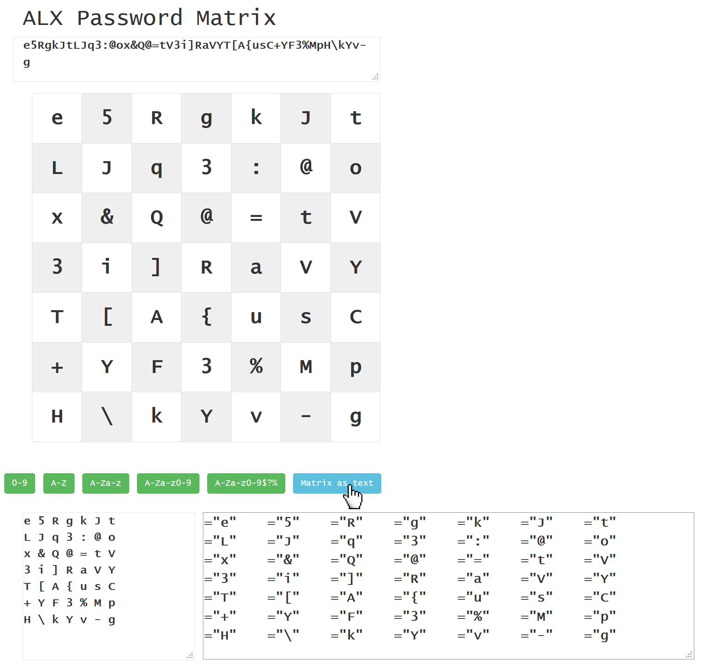
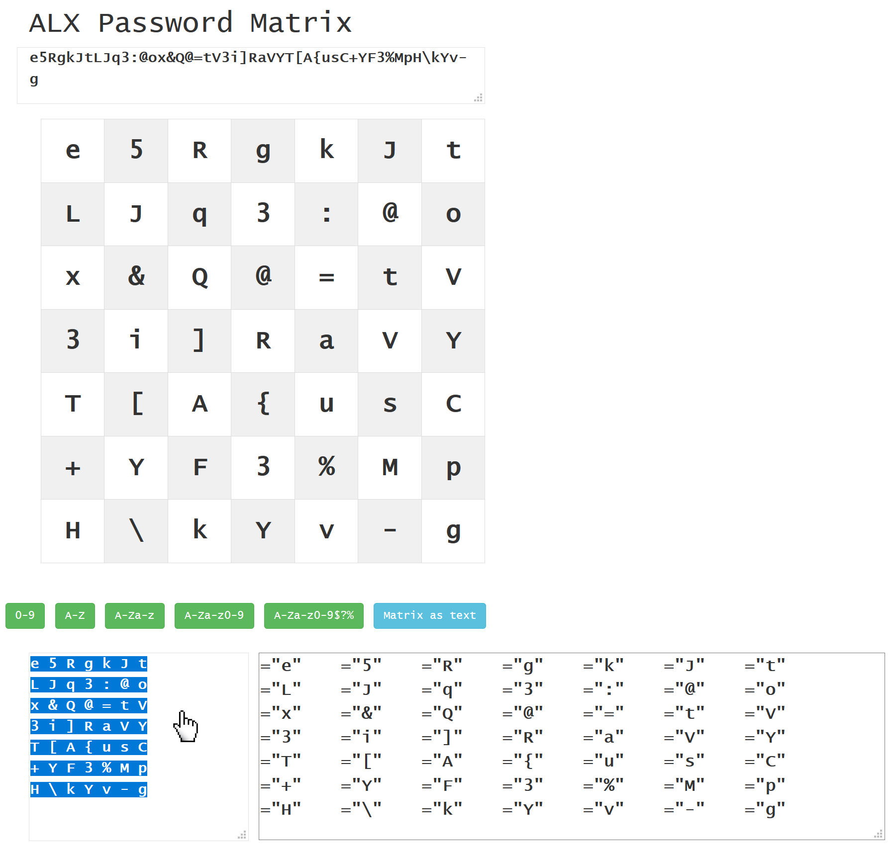

<a class="nav-button pull-right" href="../KeePass_1">weiter</a>
<a class="nav-button pull-left" href="../PasswordMatrix_3">zurück</a>
 

# 3. Neue Passwort Matrix generieren

Um eine neue Passwort Matrix zu generieren klicken sie einen der grünen Knöpfe, je nachdem welche Zeichen das Passwort enthalten darf. Zu emopfehlen sind Groß- und Kleinbuchstaben, Zahlen und Sonderzeichen, einige Seiten erlauben allerdings nur bestimmte Zeichen, z.B. zur Buchstaben und Zahlen, oder nur Zahlen.

Klicken Sie auf den Knopf `A-Za-z0-9$?%`.

Die Matrix wurde mit zufälligen Zeichen gefüllt. Anhand ihres [persönlichen Pfades](PasswordMatrix_3.md) können Sie das Passwort ablesen und auf der jeweiligen Seite entsprechend setzen und in Zukunft verwenden.

!!! hint "Zeichen anpassen"
    Einzelne Zeichen lassen sich nachträglich noch ändern, indem man in die entsprechenden Felder klickt und den Wert ändert.

!!! hint "Das Textfeld"
    Das Textfeld in der ersten Zeile enthält die Daten der Passwort Matrix am Stück. Kopieren Sie diesen Text in Ihren [Passwort Manager](KeePass_1.md). Wenn Sie den Text später in 'ALX Password Matrix' wieder einfügen wird die Matrix erneut dargestellt.

    Alternativ können Sie die Matrix auch [in Matrixform kopieren](#copyMatrix).

&nbsp;

#### Matrix als Text anzeigen und kopieren

Wenn Sie die Matrix in einem [Passwort Manager](KeePass_1.md) speichern möchten können Sie über den 'Matrix as text' Knopf die Matrix als Textblock anzeigen lassen. Es erscheint ein Textbereich und der komplette Text lässt sich per klick markieren und per Strg+C kopieren.

!!! hint "Hinweis"
    [Hier](KeePass_3.md) können Sie sehen, wie das in KeePass aussehen könnte.

<a class="nav-button pull-right" href="../KeePass_1">weiter</a>
<a class="nav-button pull-left" href="../PasswordMatrix_3">zurück</a>
 
