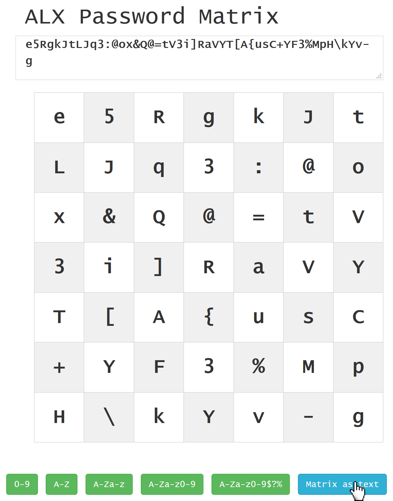

<a class="nav-button pull-right" href="../KeePass_1">weiter</a>
<a class="nav-button pull-left" href="../PasswordMatrix_4">zurück</a>
<br>

# 4. Passwort ablesen

Um ein Passwort abzulesen, öffnen Sie die Matrix in 'ALX Password Matrix' oder falls Sie die Matrix direkt lesbar im Passwort Manager gespeichert haben, können Sie das Passwort auch ohne Umweg dort ablesen.


## Direkt im Passwort Manager

Wurde die Matrix in Matrix-Form direkt im Passwort Manager gespeichert, lässt sich das Passwort mithilfe des [persönlichen Pfades](PasswordMatrix_3.md) direkt ablesen, ohne den Umweg über 'ALX Password Matrix'.

!!! hint "Hinweis"
    Auf den [folgenden Seiten](KeePass_1.md) wird genauer auf die Verwendung von Passwort Managern eingegangen.

Die Matrix aus den Beispielen vorher würde im Passwort Manager wie folgt aussehen:
```
e 5 R g k J t
L J q 3 : @ o
x & Q @ = t V
3 i ] R a V Y
T [ A { u s C
+ Y F 3 % M p
H \ k Y v - g

(12 Zeichen)
```

Anhand des [persönlichen Pfades](PasswordMatrix_3.md) lässt sich das Passwort im Kopf ablesen.

Mit folgendem (Beispiel-)Pfad wäre das Passwort mit 12 Zeichen: `R=@Q]A{u3kY`


## In ALX Passwort Matrix

Offnen Sie <a target="_blank" class="button" href="../../../PasswordMatrix.htm"><b>Password Matrix</b></a>

Kopieren Sie den einzeiligen Matrix Text aus Ihrem Passwort Manager und fügen Sie ihn in das Textfeld oben in 'ALX Password Matrix' ein. Das 'Schachbrett' wird automatisch mit den einzelnen Zeichen befüllt.

Der einzeilige Matrix Text aus dem Beispiel der vorherigen Seiten ist `e5RgkJtLJq3:@ox&Q@=tV3i]RaVYT[A{usC+YF3%MpH\kYv-g` und führt zu folgendem Ergebnis:



Anhand des [persönlichen Pfades](PasswordMatrix_3.md) lässt sich das Passwort im Kopf ablesen.

Mit folgendem (Beispiel-)Pfad wäre das Passwort mit 12 Zeichen: `R=@Q]A{u3kY`


<a class="nav-button pull-right" href="../KeePass_1">weiter</a>
<a class="nav-button pull-left" href="../PasswordMatrix_4">zurück</a>
<br>
