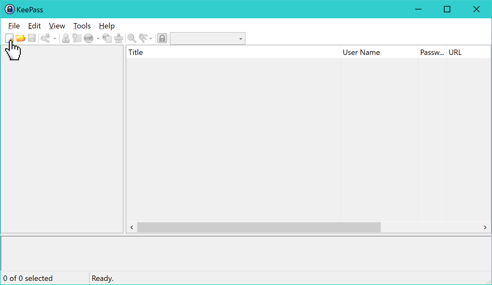
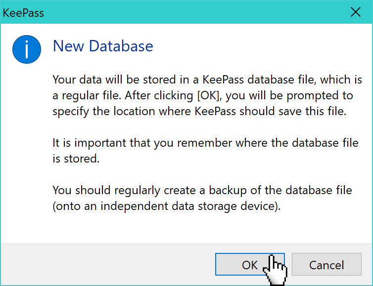
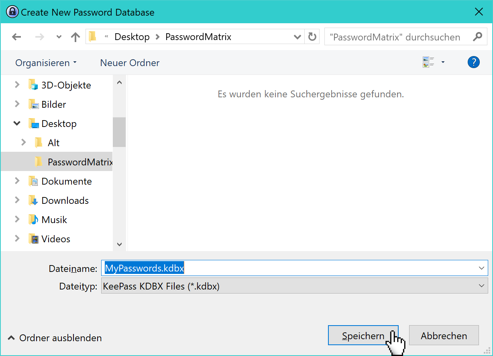
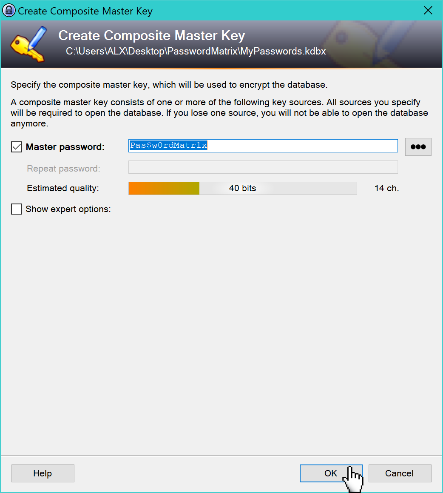
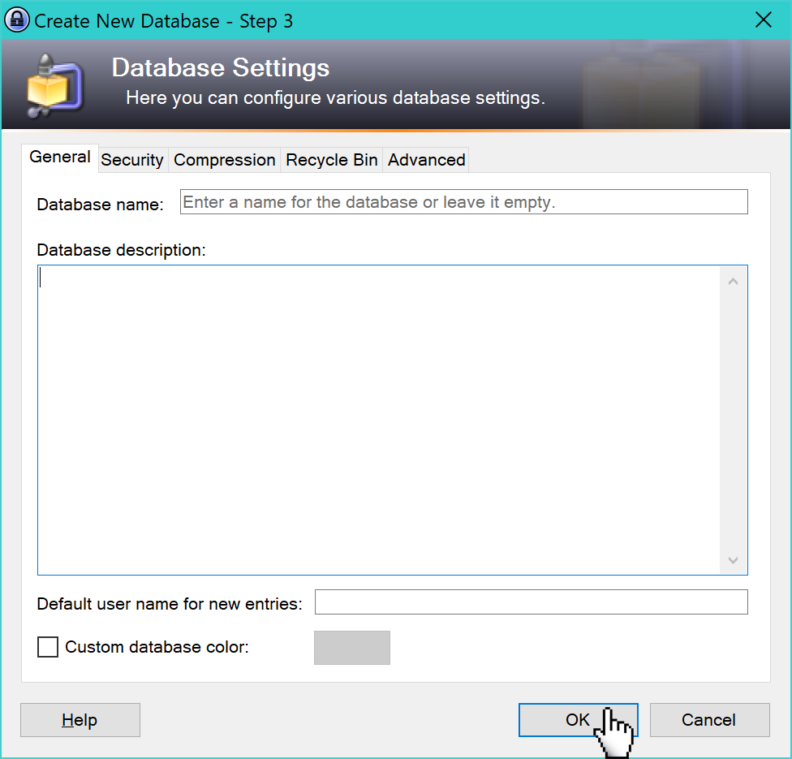
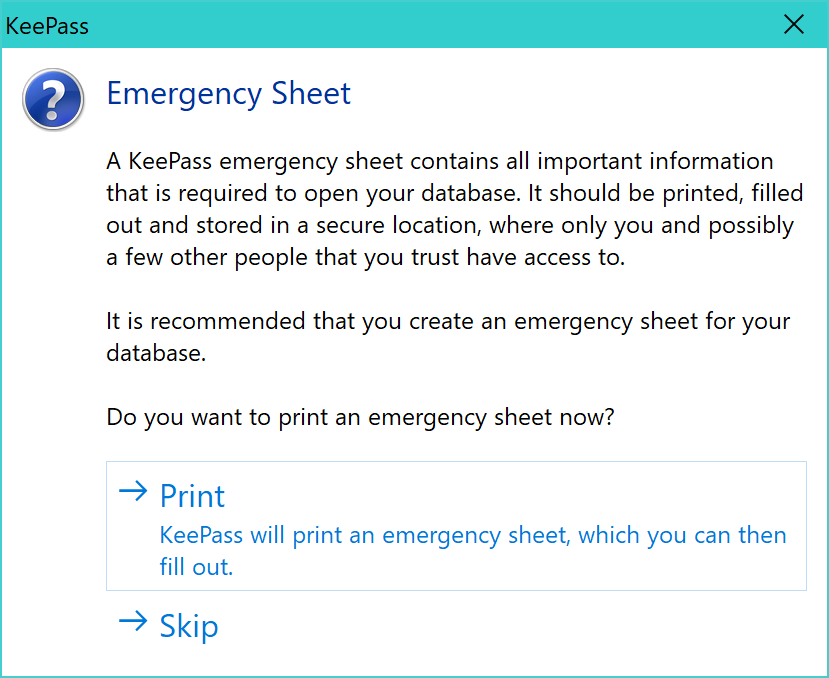
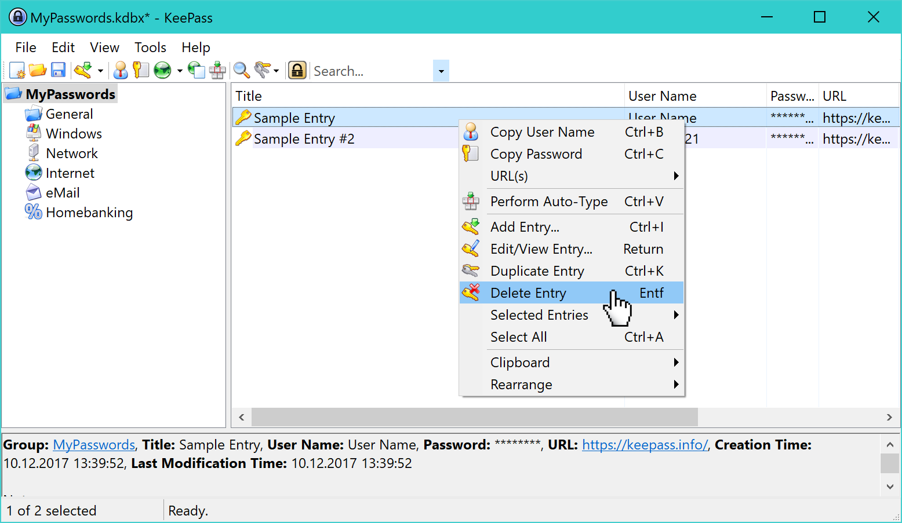

<a class="nav-button pull-right" href="../KeePass_3_de">weiter</a>
<a class="nav-button pull-left" href="../KeePass_1_de">zurück</a>
 

# Neue Datenbank anlegen

Auf dieser Seite wird beschrieben, wie sie eine neue KeePass Datenbank Datei für Passwörter anlegen. Sie können für alle Passwörter die selbe Datenbank verwenden, oder separate Datenbanken für verschiedene Passwörter anlegen.

!!! hint "Hinweis"
    Wenn Sie bereits eine KeePass Datenbank angelegt haben, können Sie diese verwenden und diesen [Schritt überspringen](KeePass_3_de.md).

<a class="nav-button pull-right" href="../KeePass_3_de">weiter</a>
<a class="nav-button pull-left" href="../KeePass_1_de">zurück</a>
 
